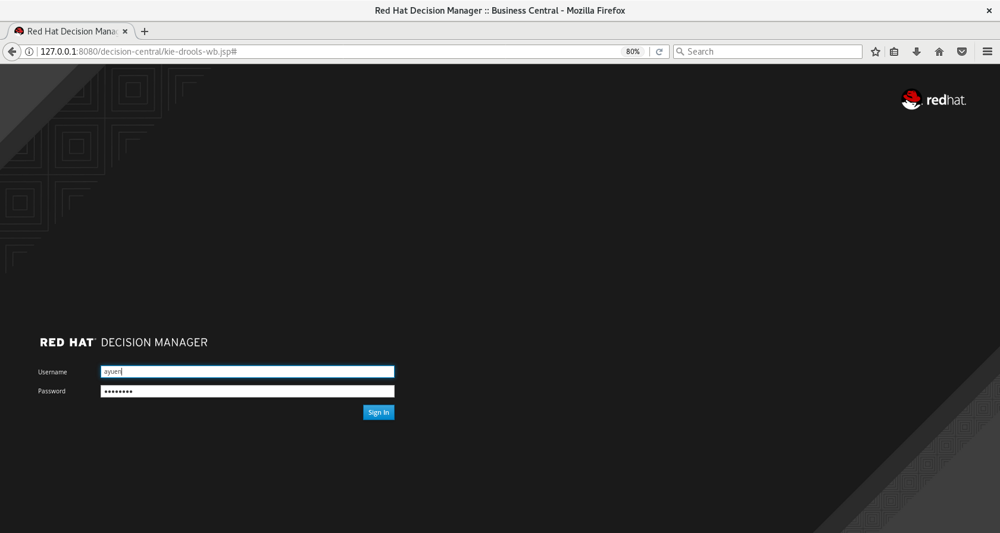

# RED HAT DECISION MANAGER 7 - A DEMO PROJECT

## USE CASE

This is a Red Hat Decision Manager 7.2 Project. It illustrates the use of rule flow to control the execution of rules.

The use case is the assessment of a credit card application. There are up to a total of 4 assessmets before an application can be approved. They are:

* Demographic assessment - age? Applicant is a bank customer?
* Credit card demographic assessment – assesses annual income, outstanding mortgage borrowings amount, savings and investments balance amount
* Score card - assign scores based on: # of default payment in last 12 months, declared bankruptcy and years with the bank
* Final assessment – an applicant must pass first 2 tests and obtain a credit score greater than or equal to 500

## IMPLEMENTATION

A screenshot of Decision Central is shown below:

It shows the rule flow diagram on the right-hand pane which implements the use case. It also shows the rules, on the left-hand pane, written using:

* DRL, the Drools Rules Language - Approval
* Guides Decision Tables - creditCardDemographicsAssessment, creditScore, DemographicAssessment and final-assessment
* Guided Rules usinf DSL (Domain Specici Language) - adultBankCustomer, adultNotBankCustomer and underage

The Approval DRL and the final-assessment decision table implement the same rules in a different way. The rule set are interchangeble. You can switch to use one or the other by changing the rueflow-group in the "Make Decision" task in the rule flow diagram.

Similarly, the DemographicAssessment decision table and the 3 Guided Rules implement the smae logic. Again, you can switch to use one or the other by changing the rueflow-group in the "Make Demographic Assessment" task in the rule flow diagram.

## DEMO VIDEO

I've created a 30+ minutes video on youtube to go with this repository:

The json file used in the video to interact with the deployed rules application is shown below:
<pre>
{
	"lookup": "myStatelessSession",
	"commands": [{
			"insert": {
                                "out-identifier": "in",
				"object": {
					"com.myspace.risk.Applicant": {
						"age": 2,
						"existingCustomer": true,
						"annualIncome": 200000,
						"mortgageAmount": 500000,
						"accountBalance": 100000,
						"bankruptcy": false,
						"numberOfDefaultPaymentsLast12Months": 5,
						"yearsWithBank": 10,
						"totalCreditScore": 0

					}
}
		}
	},
	{
		"start-process": {
			"processId": "risk.risk-assessment"

		}
	},
	{
		"fire-all-rules": ""
	},
	{
		"get-objects": {
			"out-identifier": "objects"
		}
	}]
}
</pre>

No external tools are required to develop the application nor to deploy it in the Decision Server. The demo covers 5 topics. I've listed them below. It also gives the start time of each topic so that you can fast forward to a particular topic if you desire.

*  5.42 - Data Model and Business Rules
* 14.35 - Rule Flow
* 18.41 - Test Scenerios
* 21.58 - Deployment and Interaction
* 28.19 - Technical How-to's

## IMPORT PROJECT INTO DECISION CENTRAL

The following screenshots shows how to import this project into Decision Central:
1. Login

2. From the Home page, click on "Design" near the centre to the left

3. Click on the 3 vertical dots and select "Import Project"

4. Enter github URL

5. Select riskAssessment and click on OK

## ENJOY ;-) !!! 
